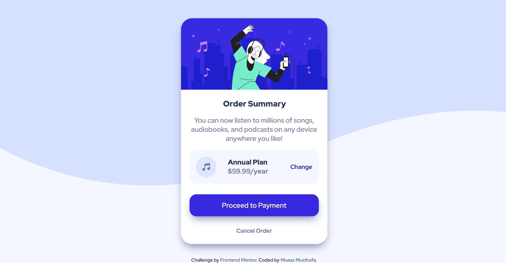

# Frontend Mentor - Order summary card solution


### Screenshot
Desktop view

Mobile view


## My process

### Built with

- HTML
- CSS properties
- CSS Flexbox

**Note: These are just examples. Delete this note and replace the list above with your own choices**

### What I learned

Use this section to recap over some of your major learnings while working through this project. Writing these out and providing code samples of areas you want to highlight is a great way to reinforce your own knowledge.

To see how you can add code snippets, see below:


```css
.proud-of-this-css {
  box-shadow: 0px 10px 20px -6px var(--neutral-blue);
}
```

### Useful resources

- [W3 schools](https://www.w3schools.com/) - This helped me for knowing the css properties like box-shadow, bakground properties.


## Author

- Frontend Mentor - [@Muaaz08](https://www.frontendmentor.io/profile/Muaaz08)
- Twitter - [@musthafa_muaaz](https://twitter.com/musthafa_muaaz)


